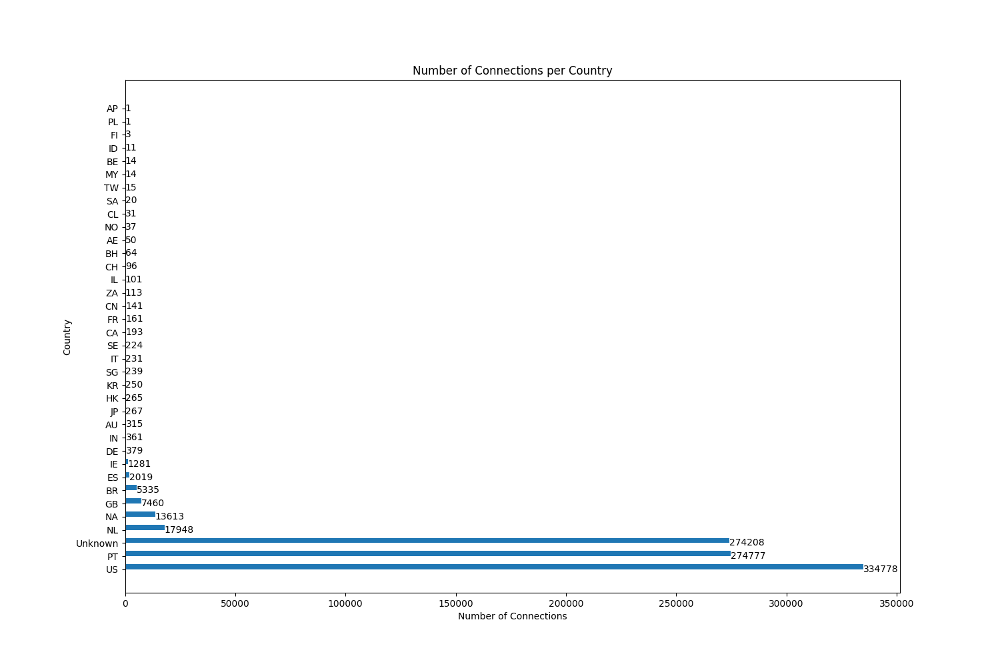
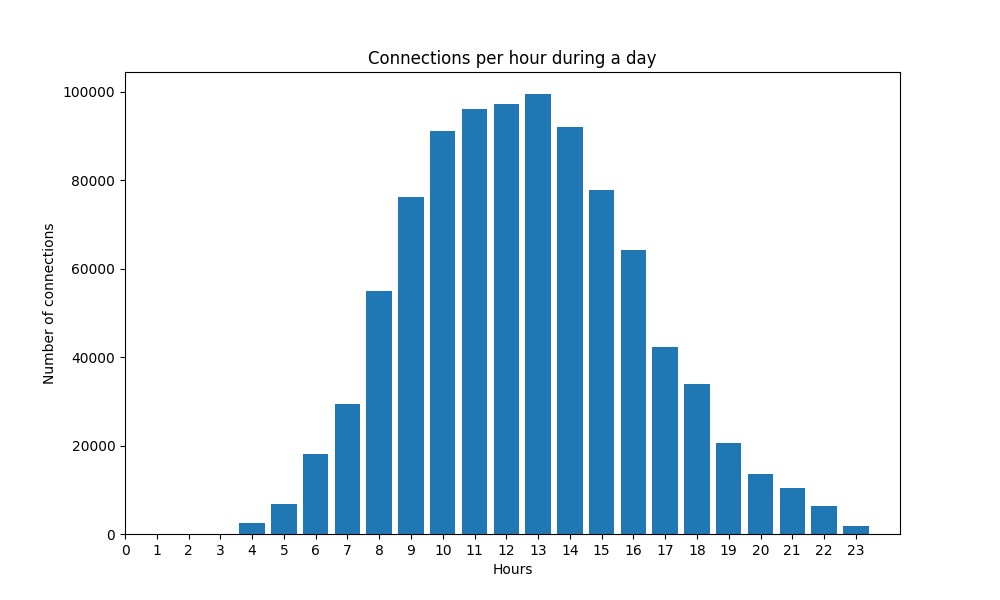

# Sentinel

This is a traffic analysis tool complete with a _Command Line Interface_ (CLI) developed in order to streamline the analysis of traffic captures.

At the moment of this report, Sentinel allows highly specific and precise metric measurements, such as:

- Search for possible **exfiltration**.
- Search for possible **botnet and C&C** communication.
- **Volume** of connection **per destination**.
- **Hourly** connection **volume**.

## Architecture

This tool was developed in **Python** version 3.11.2 and **Poetry**, which is a tool for dependency management and packaging. It allows for the declaration of libraries in a project and it will manage (install/update) this dependencies automatically. Poetry offers a lockfile to ensure repeatable installs, and can build a project for distribution.

## Installation

Sentinel is publicly available at [PyPi](https://pypi.org/project/sentinel-analysis/) and it is recommended that the installation is done using [Pipx](https://pypa.github.io/pipx/), however, it is **NOT** absolutely necessary.

```
pipx install sentinel-analysis
```

## Running

After installation, the tool can be called from any terminal session with the `sentinel` command.

```
$ sentinel -h
usage: sentinel [-h] --data DATA -gi GI -gin GIN [-dx DATAEXFILTRATION] [-bn BOTNET] [-cv] [-td] [-q] [-p]

Traffic analysis tool.

options:
  -h, --help            show this help message and exit
  --data DATA           Path to datafile to analyze
  -gi GI                Geolocation IP database
  -gin GIN              Geolocation IP database with nameserver
  -dx DATAEXFILTRATION, --dataExfiltration DATAEXFILTRATION
                        Threshold percentage for outliers in upload/download byte amount. Example '-dx 90' will return the top 10%
  -bn BOTNET, --botnet BOTNET
                        Detecting possible botnet communication in specified networks, or all networks. Example '-bn 192.168.1.0/24' will search P2P communication within that network
  -cv, --countryVolume  Measures the connection volume per country
  -td, --trafficDistribution
                        Generates a graph illustrating the hourly distribution of the volume of connections during a day
  -q, --quiet           Suppress stdout
  -o, --outfileMd       Export to markdown file
```

### Options

There are multiple options for processing, and each one is only executed if explicitly called. There are, however, **three** mandatory parameters that **must be provided**.

- **data** - _Required_ - Path to the _paquet_ file containing the traffic capture to be analyses.
- **gi** - _Required_ - Path to the _dat_ file containing the IP geolocation database.
- **gin** - _Required_ - PAth to the _dat_ file containing the IP geolocation of nameservers database.

Some **anomalous** behavior can be searched for by using the following options:

- **dx** - By specifying an integer between 0 and 100, the user is filtering for flows above the download over the upload percentile of all the connections in the session.
- **bn** - The user can specify in which subnet to look for P2P communication, which can indicate the presence of a botnet. If 0.0.0.0/0 is used, it will search in all subnets found.

For getting a general overview of the traffic, two commands are also available:

- **cv** - Measures the number of connections per country of destination.
- **td** - Measures the traffic hourly volume distribution.

# Traffic Analysis

Now we will perform an overall analysis of a traffic capture file with all of the options selected and analyze the data recovered, as well as inspect how the calculations for each of the metrics is performed.

The code presented next demonstrates a comprehensive set of SIEM rules specifically tailored to detect and combat two major security threats: data exfiltration and botnets. These rules have been meticulously crafted to analyze network traffic patterns, monitor system logs, and identify anomalous behaviors indicative of data exfiltration attempts. By leveraging these SIEM rules, organizations can effectively safeguard their sensitive data from unauthorized exfiltration and combat the growing menace of botnets, ensuring a resilient and secure computing environment.

Sentinel will be called in the following manner:

```
sentinel --data ../dataset4/data4.parquet -gi ../GeoIP_DBs/GeoIP.dat -gin ../GeoIP_DBs/GeoIPASNum.dat -cv -td -dx 90 -bn 192.168.104.0/24 -o
```

Note that the only option not selected is `--quiet` as it would suppress all _stdout_.

Note also that the flag `-o` is selected, what this does is creates a markdown file at the end of the analysis with all of the generated data. This can be useful for posterior archiving.

<br>

## Country connection volume

The objective of this measurement is simply to understand **which countries are more targeted as connection destinations** and which country has **downloaded more data**. When executed, it produces the following output at the console,

```
[!] Calculate the country of origin of the destination IPs and the connection volume for each country. Generating a PNG with the bar graph.

         dst_ip   down_bytes
          count          sum
country                     
US       334778  39621538092
PT       274777  26423827803
         274208  15754974807
NL        17948   1728071763
NA        13613   1310943454
GB         7460    717314962
BR         5335    512859364
ES         2019    196188082
IE         1281    118558649
...
```

<div style="page-break-after: always;"></div>

and generates the following graph as a PNG image.

<p align="center">
  
</p>

### Code

``` python
def countryVolume():
    ...
    # Analyses of destination countries' connection volume
    countries = data
    countries["country"] = countries["dst_ip"].apply(
        lambda ip: gi.country_code_by_addr(ip)
    )

    # Associates each country with its number of connections and the total
    #  data downloads by it. For normal flows they should be directly proportional
    volume = countries.groupby(["country"]).agg(
        {"dst_ip": ["count"], "down_bytes": ["sum"]}
    )
    
    # Sorting the DataFrame by dst_ip column in descending order
    volume = volume.sort_values(("dst_ip", "count"), ascending=False)

    printq(volume)
    ...
```

## Hourly traffic distribution

The objective of this measurement is to understand the **time of the day** in which there is a **higher volume of connections**.

hen executed, it produces the following output at the console,

```
[!] Distribution of connection volume during the day.

hour
4      2439
5      6845
6     18117
7     29313
8     55071
9     76117
10    91050
11    96017
12    97340
13    99522
14    92054
15    77853
16    64196
...
```

and generates the following graph as a PNG image.

<p align="center">
  
</p>

<br>

### Code

``` python
def trafficDistribution():
    ...
    traffic = data
    traffic["hour"] = pd.to_datetime(traffic["timestamp"] / 100.0, unit="s").dt.hour
    hourly = traffic["hour"].value_counts().sort_index()
    fig, ax = plt.subplots(figsize=(10, 6))
    ax.bar(hourly.index, hourly.values)
    ax.set_xlabel("Hours")
    ax.set_ylabel("Number of connections")
    ax.set_title("Connections per hour during a day")
    ax.set_xticks(range(24))

    filepath = "connectionsxhour"
    fig.savefig(fname=filepath)

    printq(hourly)
    ...
```

## Data exfiltration

For data exfiltration analysis we focused on the fact that although the amount of downloaded data is usually larger than the uploaded data if the service is the same for all of the clients during the session, the ratio of this two values should (if normal behaviour is considered) be similar for all the clients.

If a particular client demonstrates a particular large ratio of downloads over uploads, this might indicate that it is extracting a large amount of data, possibly with malicious intent.

This is the generated output at the console,

```
[!] IPs above the 90 percentile of the downloads over uploads in this session.

              src_ip  down_bytes  up_bytes      ratio
110  192.168.104.200    14778895   1415961  10.437360
116  192.168.104.206    53495023   5195056  10.297295
64   192.168.104.159   324226107  32356733  10.020360
144   192.168.104.44    98180581   9977423   9.840274
131   192.168.104.31   259857369  26500446   9.805773
174   192.168.104.74   385717683  39392101   9.791752
184   192.168.104.84   193031076  19880947   9.709350
90   192.168.104.182   609527835  63089225   9.661362
...
```

### Code

```python
def dataExfiltration(percentage):
    percentage = 1 - (percentage / 100)

    # Calculate the total downloaded and uploaded bytes per IP
    ratios = data.groupby(["src_ip"], as_index=False)[["down_bytes", "up_bytes"]].sum()

    # Calculate the ratio between downloaded and uploaded bytes
    ratios["ratio"] = ratios["down_bytes"] / ratios["up_bytes"]

    # Sort by ratio
    ratios = ratios.sort_values(["ratio"], ascending=False)

    # Top outliers based on percentage
    outliers = ratios.head(int(len(ratios) * percentage))

    printq(outliers)
```

## Botnet communication

It is not usual for devices within the same network in a corporate environment to engage in _peer-to-peer_ communication, if so, this may indicate that botnets, C&C, or horizontal traversal may be taking place within the network.

This is the generated output at the console when the botnet detection algorithm is executed,

```
[!] Flows between internal hosts to common destinations in the same subnet (192.168.104.0/24), may indicate the existence of an internal botnet.

            dst_ip                                             src_ip  frequency
1  192.168.104.224  [192.168.104.82, 192.168.104.63, 192.168.104.2...   0.008091
3  192.168.104.231  [192.168.104.82, 192.168.104.63, 192.168.104.2...   0.007870
2  192.168.104.230  [192.168.104.82, 192.168.104.63, 192.168.104.2...   0.005934
5  192.168.104.234  [192.168.104.82, 192.168.104.63, 192.168.104.2...   0.005923
0  192.168.104.222  [192.168.104.82, 192.168.104.63, 192.168.104.2...   0.005816
4  192.168.104.232  [192.168.104.82, 192.168.104.63, 192.168.104.2...   0.005724
```

### Code

``` python
def botnet(subnet):
    subnet = ipaddress.IPv4Network(subnet)

    # Filter to src_ip for desired subnet
    same_subnet = data
    same_subnet["src_ip"] = same_subnet["src_ip"].astype(str)

    # Filter to src_ip and dst_ip in the same desired subnet
    same_subnet = same_subnet.loc[
        (data["src_ip"].apply(lambda x: ipaddress.IPv4Address(x) in subnet))
        & (data["dst_ip"].apply(lambda x: ipaddress.IPv4Address(x) in subnet))
    ]

    # Associates each dst_ip with a set of IPs and a set of timestamps
    same_subnet = same_subnet.groupby(["dst_ip"], as_index=False).agg(
        {"src_ip": list, "timestamp": list}
    )

    # Calculate the frequency of the communications
    def frequency(comms, period):
        return len(comms) / (period[-1] - period[0])

    same_subnet["frequency"] = same_subnet.apply(
        lambda x: frequency(x.src_ip, x.timestamp), axis=1
    )

    # Clean non relevant series
    same_subnet = same_subnet.drop(["timestamp"], axis=1)

    # Clean repeated IPs
    same_subnet["src_ip"] = same_subnet["src_ip"].apply(lambda x: list(set(x)))

    # Order
    same_subnet = same_subnet.sort_values(["frequency"], ascending=False)

    printq(same_subnet)
    ...
```
